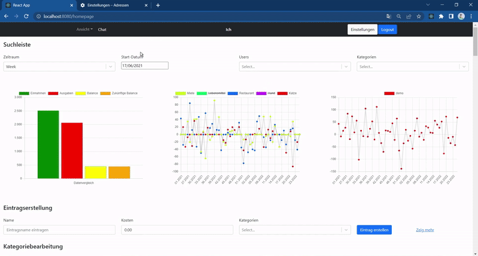
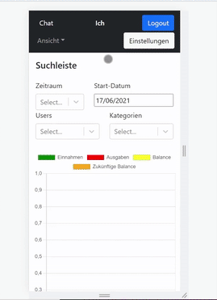
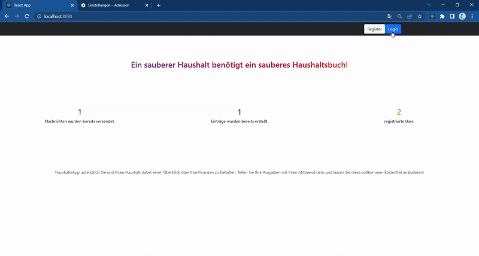
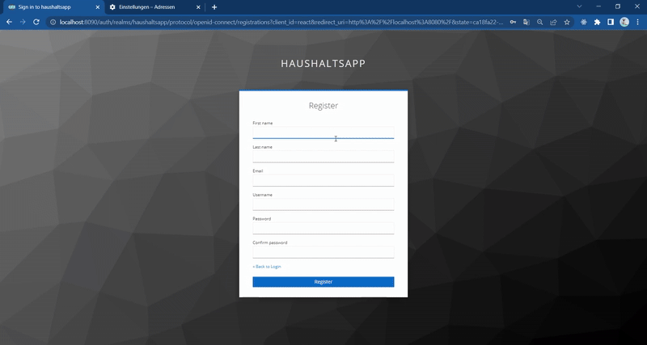
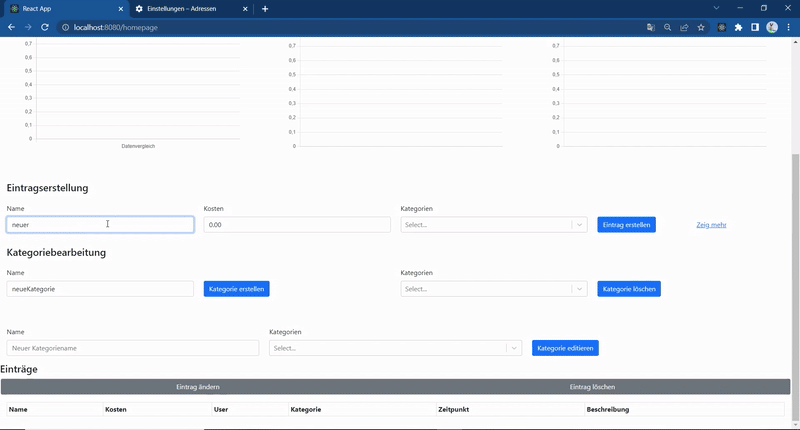
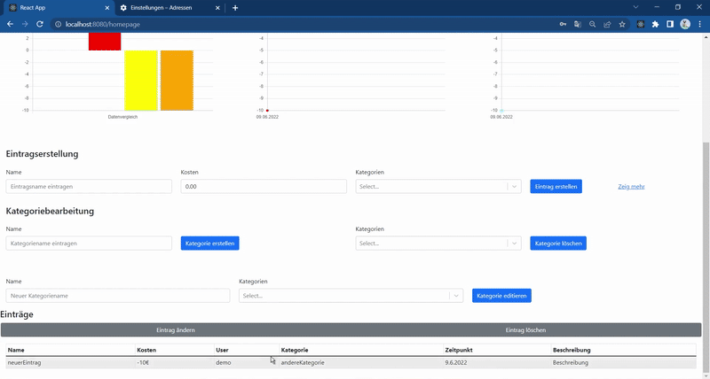
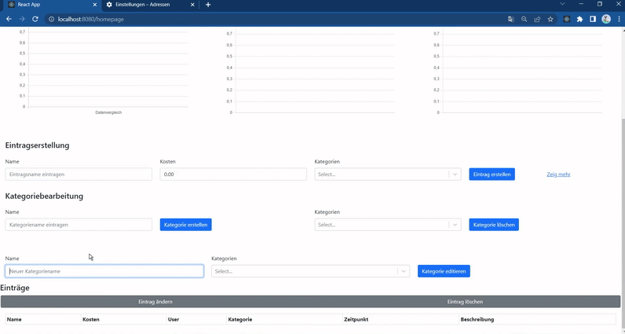
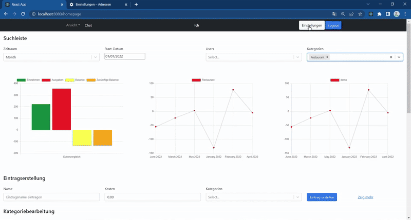
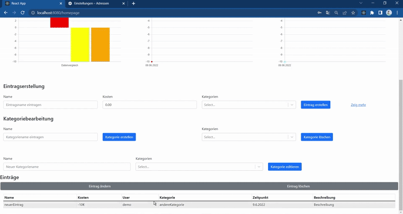
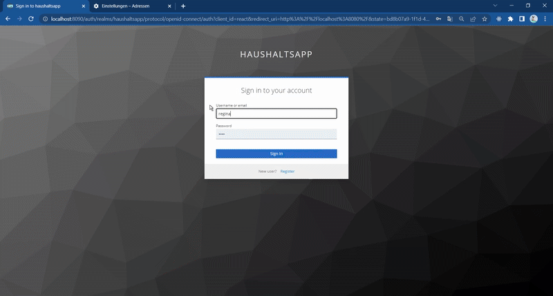

# 💰 SparApp – Save Smart. Spend Smarter.

**SparApp** is a modern full-stack budgeting tool – designed with students, roommates, and small groups in mind.

From creating personal and group savings entries to visualizing trends and chatting in real-time – this app does it all.

  
  

---

## 🎓 Project & Context

This application was developed as part of our studies at **Aalen University** during the **Cloud and Distributed Computing** course.  
Our goal was to build a **secure, scalable, cloud-ready** app with:

- Authenticated personal spaces
- Extensive Group & User Management
- Shared group data
- Real-time communication features
- Data visualization and projections
- Full Mobile and desktop-sized Webbrowser support
- Scalability in mind

---

## 🔧 Architecture Overview

- **Frontend:** 
  - React.js 
  - Redux Store
  - REST API integration 
  - Keycloak Auth integration
- **Backend:** 
  - Multiple Java Spring Boot Microservices
- **Auth:** 
  - Keycloak
- **Databases:** 
  - PostgreSQL
  - MongoDB
  - Redis (Sub/Pub Plugin)
- **Deployment:** 
  - Docker 
  - Kubernetes

---

## 🌐 Core Features

| Feature                  | Description                                                             |
|--------------------------|-------------------------------------------------------------------------|
| 🔐 Auth                 | Login, logout, register via Keycloak                                     |
| 📚 Entries              | Create, update, delete savings entries                                   |
| 🗂️ Categories           | Manage personal and group categories                                     |
| 📈 Visualization        | Charts by user, category, and time                                       |
| 🤝 Groups               | Create, join, leave groups; invite users                                 |
| 💬 Chat                 | Real-time group chat with WebSocket & Redis                              |
| 🔍 Filters              | Search and filter entries in flexible dashboards                         |
| 📉 Inflation Support    | Adjust savings and forecasts using real inflation data                   |

---

## 🎞️ Feature Highlights

### 🔐 Logging In

### 🆕 Registering

### 📊 Visualizing Entries

### ✏️ Creating, Editing and Deleting Entries
#### Creating a Saving Entry

#### Editing and Deleting Entries

### 🗂️ Managing Categories

### 👥 Managing Groups

### 💬 Group Chat – Sending
#### Sending

#### Receiving

### 📱 Mobile Visualization

---

## 🖥️ UI Highlights

### Homepage View
The main interface features:

- Entry table with full CRUD
- Category manager (create/edit/delete)
- Search & filter by user, date, and category
- Financial charts and projections

> Fully responsive, mobile-ready design.

---

### Charts & Analytics

The dashboard visualizes:

- Income vs Expenses
- Category distribution over time
- User-specific and group-based trends
- Historical + future budget projections

---

### 💬 Real-Time Group Chat

Stay in sync with your group through an integrated chat system – powered by:

- WebSocket connections
- Redis Pub/Sub channels
- Message history persistence

---

## 🛠️ Getting Started

### Requirements

- Docker + Docker Compose
- Java 17
- Node.js 16+
- Kubernetes (optional for deployment)

## 🎞️ Feature Highlights – Scrollable GIF Carousel

