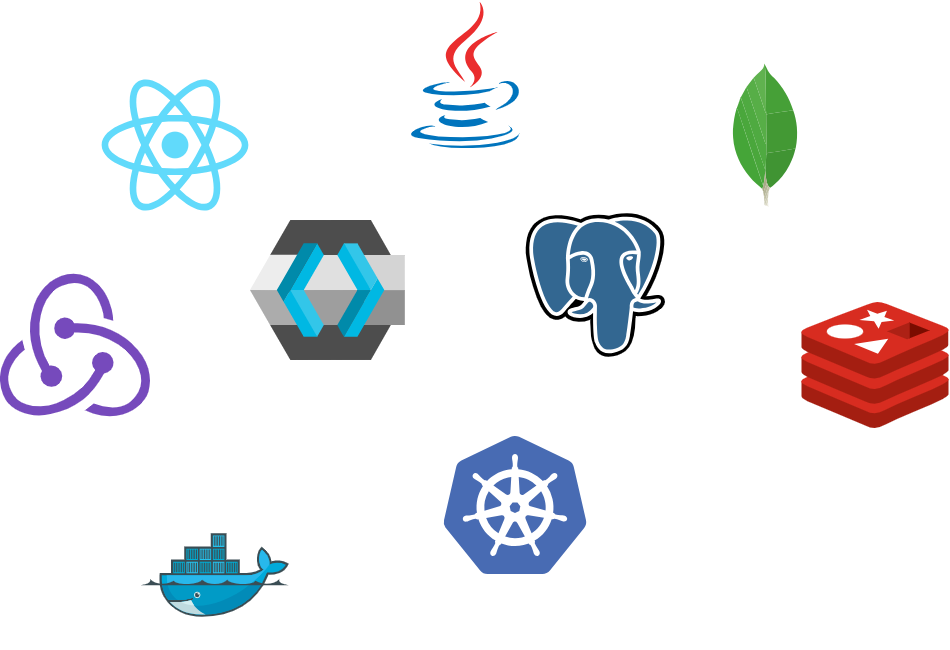
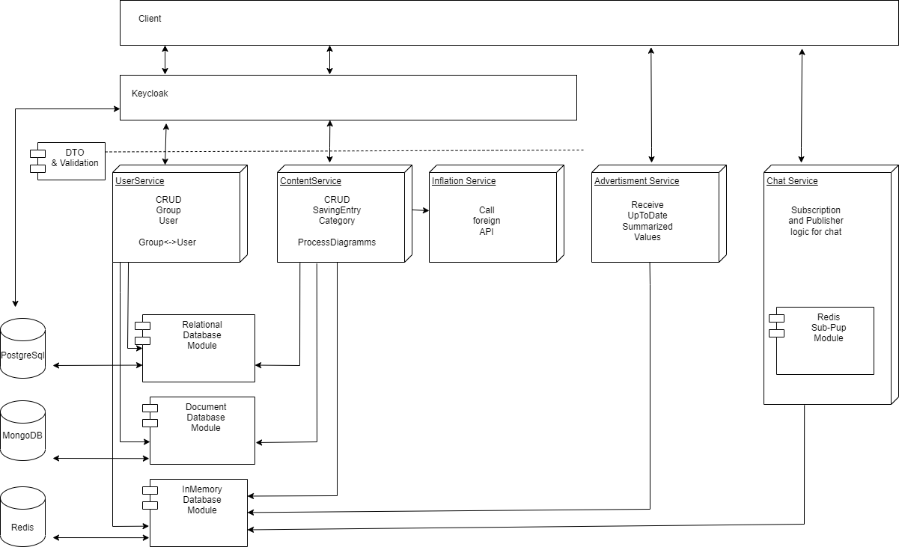
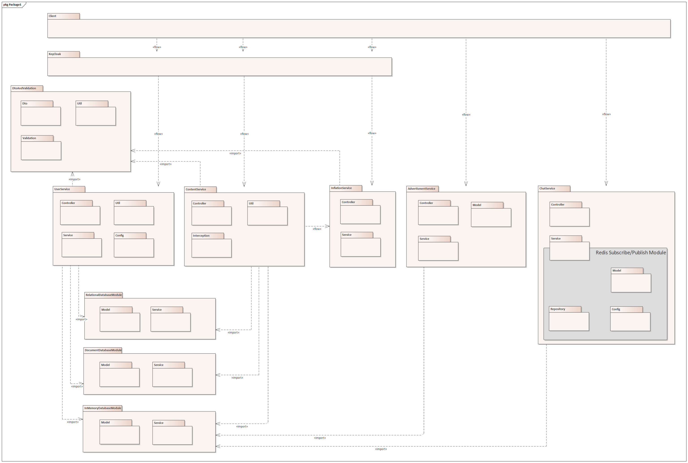
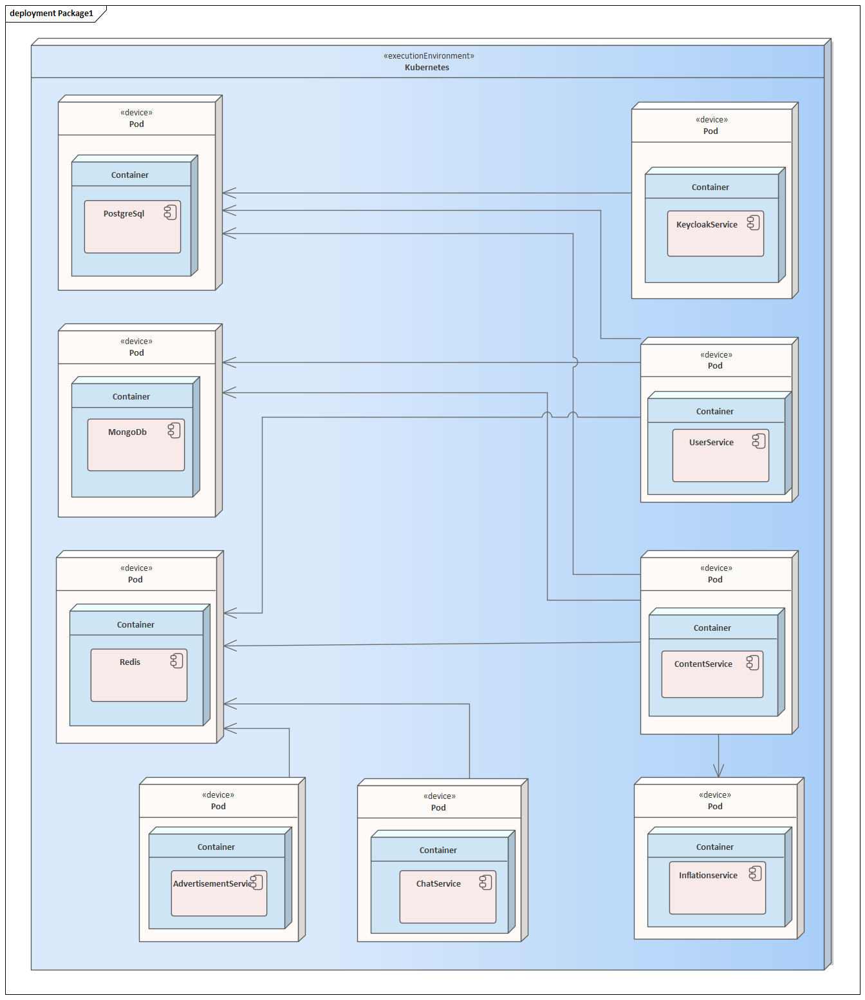
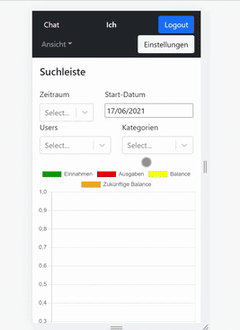

# 💰 Haushaltsapp – Save Smart. Spend Smarter.

**Haushaltsapp** is a full-stack budgeting and savings application – designed for students, roommates, and small groups.  
Track entries, collaborate with others, and visualize trends – all in real time, across devices.

  
  

---

<!-- TOC -->
* [💰 Haushaltsapp – Save Smart. Spend Smarter.](#-haushaltsapp--save-smart-spend-smarter)
  * [🎓 Project & Context](#-project--context)
  * [🌐 Core Features](#-core-features)
  * [🔨 Technical Overview](#-technical-overview)
  * [🔧 Architectural Overview](#-architectural-overview)
  * [🎞️ Feature Highlights](#-feature-highlights)
    * [🔐 User Management](#-user-management)
    * [📊 Visualizing Entries](#-visualizing-entries)
    * [✏️ Managing Entries & 🗂️ Categories](#-managing-entries---categories)
    * [👥 Managing Groups](#-managing-groups)
    * [💬 Real-Time Group Chat](#-real-time-group-chat)
    * [📱 Mobile Visualization](#-mobile-visualization)
  * [🧑‍💻 Teamwork makes the Dream Work](#-teamwork-makes-the-dream-work)
  * [📜 License](#-license)
  * [🖼️ Videos](#-videos)
<!-- TOC -->

---

## 🎓 Project & Context

This application was developed as part of our studies at **Aalen University** during the **Cloud and Distributed Computing** course.  
Our goal was to build a **secure, scalable, cloud-ready** app with:

- Authenticated personal spaces
- Extensive Group & User Management
- Shared group data
- Real-time communication features
- Data visualization and projections
- Full Mobile and desktop-sized Webbrowser support
- Scalability in mind

This readme only gives a brief overview. 
A detailed description in the form of a 
software architecture document (SWAD) in german can be found [here](doc/SWAD.pdf).

---

## 🌐 Core Features

| Feature                  | Description                                                             |
|--------------------------|-------------------------------------------------------------------------|
| 🔐 Auth                 | Login, logout, register via Keycloak                                     |
| 📚 Entries              | Create, update, delete savings entries                                   |
| 🗂️ Categories           | Manage personal and group categories                                     |
| 📈 Visualization        | Charts by user, category, and time                                       |
| 🤝 Groups               | Create, join, leave groups; invite users                                 |
| 💬 Chat                 | Real-time group chat with WebSocket & Redis                              |
| 🔍 Filters              | Search and filter entries in flexible dashboards                         |
| 📉 Inflation Support    | Adjust savings and forecasts using real inflation data
---

## 🔨 Technical Overview

One aspect of this project was to familiarize ourselves with a wide range of
technologies in order to gain a broad overview. These are the technologies we used.

- **Frontend:**
  - React.js
  - Redux Store
  - REST API integration
  - Keycloak Auth integration
- **Backend:**
  - Multiple Java Spring Boot Microservices
- **Auth:**
  - Keycloak
- **Databases:**
  - PostgreSQL
  - MongoDB
  - Redis (Sub/Pub Plugin)
- **Deployment:**
  - Docker
  - Kubernetes
---

## 🔧 Architectural Overview

The system essentially consists of **microservices**, **shared modules**, **databases**,
the reverse proxy **Keycloak** and the **client app**.

The client makes requests to the microservices. These pass through the reverse proxy,
which authenticates or rejects the requests. The microservices accept the incoming
requests and execute their business logic by using the implemented modules.

The modules offer functionality that is used by several microservices. This applies,
for example, to the persistence of objects or validation of shared Data Transfer Objects.

The application is designed in a cloud-ready manner.
For our non-production operation, we operated the databases directly in
kubernetes in pods. The remaining applications are provided via deployments
and exposed with services.

---

## 🎞️ Feature Highlights

### 🔐 User Management

The application is secured by an **OIDC Authorization Code Flow** implemented by **Keycloak**.
Users can register, log in, and join multiple groups.

  
  

---

### 📊 Visualizing Entries

The dashboard visualizes:

- Income vs Expenses
- Category distribution over time
- User-specific and group-based trends
- Historical + future budget projections (with inflation!)

  

---

### ✏️ Managing Entries & 🗂️ Categories

Well what would you expect from a saving app? 😅

Haushaltsapp offers full:
- 📝 Entry CRUD (create, read, update, delete)
- 🗂️ Category CRUD (personal & group-wide)

  
  
  

---

### 👥 Managing Groups

Users can:

- Create new groups
- Send and accept invitations
- Leave groups at any time

Groups enable member-specific filtering and communication through integrated chat.

  

---

### 💬 Real-Time Group Chat

Stay in sync with your group through an integrated chat system – powered by:

- WebSocket connections to a dedicated chat-service
- Pub/Sub channels powered by a Redis-Plugin
- Message history persistence

  
  

---

### 📱 Mobile Visualization

All features are fully mobile-compatible.  
Even on smaller screens, charts, filters, and controls remain accessible and intuitive.

  
  

---

## 🧑‍💻 Teamwork makes the Dream Work

Developed by:

- Simon Ruttmann
- Veronika Scheller
- Michael Ulrich
- Robin Röcker

---

## 📜 License

Licensed under the [Apache 2.0 License](LICENSE).  
Feel free to fork, adapt, and use it – just give credit. 🤝

---

## 🖼️ Videos

🎬 [Watch Desktop Walkthrough (MP4)](media/video/Desktop-Walkthrough.mp4)  
🎬 [Watch Mobile Walkthrough (MP4)](media/video/Mobile-Walkthrough.mp4)

---